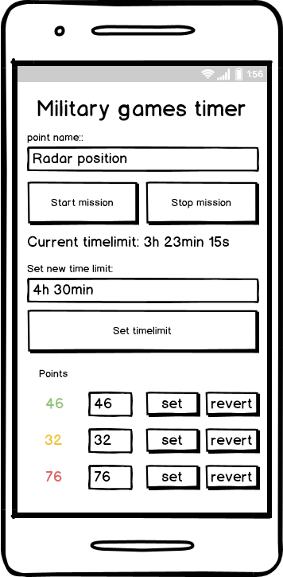

# strikeballtimer
timer for military games

## Player's scenarios:
There are 3 sides. Each side should start counting points for their side by pressing a button with the color of their team.
LED will change blinking to another color after pressing button of the another team that is receiving points now. After 1 minute after starting counting for some side, 1 point will be incremented to their side.

If another side will intercept point with timer and press button timer will stop counting for the previous team and will start counting for a new one.

If some team members will press button ones more after starting counting nothing will appear. This is "safer" against the mistakes of team members.

The game will continue until game time left.

The timer is ready to use after activation by Admin and will start count for the team just after pressing a button.

## Admin's scenarios:
Admin can:
- start game
- stop game
- set duration of the game

Changing setting is available via HTTP from any mobile device witch is available after connection to the WiFi of the timer. The timer could be turned on/off to save energy by special switcher.

## Features
- In case of loss of power, Timer will save current stats to the EEPROM (energy non-volatile memory)
- The OLED display will show current status for all teams (could be adjusted by admin)
- hide/show results of counting for players (to save intrigue till the end of the game end)

# Scheme of elecric part

# Wireframe of browser view of admin side

